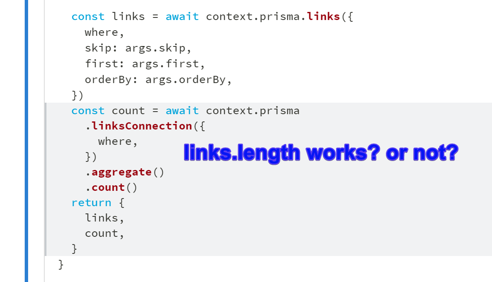
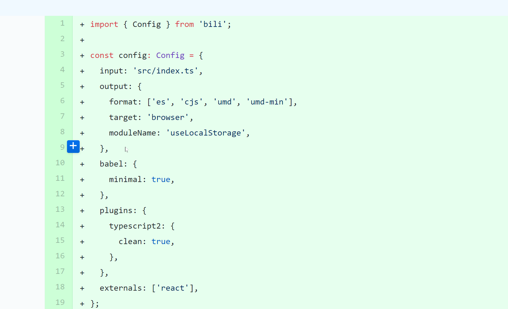
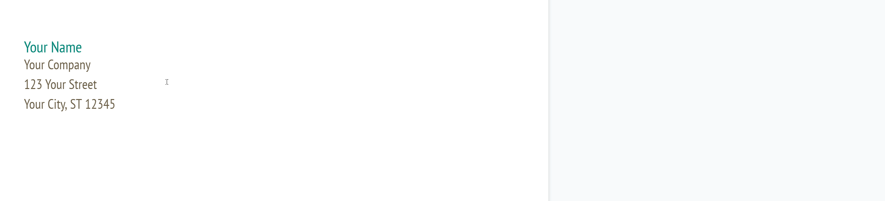

# What is this?

As I was reading https://www.howtographql.com/graphql-js/8-filtering-pagination-and-sorting/,
I wanted to ask a question by leaving a comment at a specific section, which can be answered there right where the question is asked.

But there isn't a way to leave a comment not to mention right at that location.

# Suggestions?

1. GitHub style comment on the line.
   

- **Up**: Easy to leave a comment & reply. Easy to spot.
- **Down**: Hard to implement as HTML text flows unlike code samples above.

1. Google Doc style comment
   

- **Up**: Doesn't change the flow of the page & comment stands out
- **Down**: Harder to use - Need to highlight for the "comment" button to show up.

# Compromise? ('tween Github & Google Doc styles)

On hover of a paragraph, add the "+" as GitHub shows, but instead of leaving the comment in-line disrupting the flow of the content, add the comment on the right like Google Doc does.

# Implementation Brainstorm?

1. Vanilla JS
   - Framework agnostic?
   - Isomorphic?
1. React
   - How to inject to `
`?
   - A hook? A component factory? 🤔
1. Gatsby - Create a plugin to wrap each paragraph.
   - [wrapRootElement][wraprootelement] - Provide the whole site with the comment system
   - [wrapPageElement][wrappageelement] - Provide the per-page level comment

[wraprootelement]: https://www.gatsbyjs.org/docs/browser-apis/#wrapRootElement
[wrappageelement]: https://www.gatsbyjs.org/docs/browser-apis/#wrapPageElement
